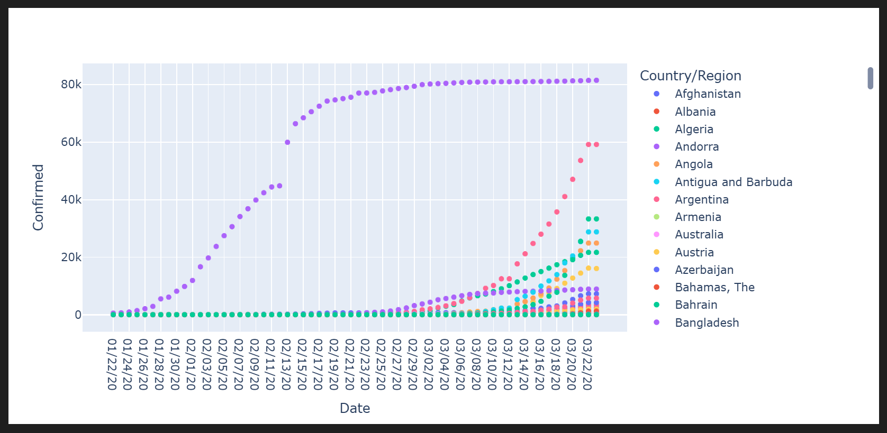
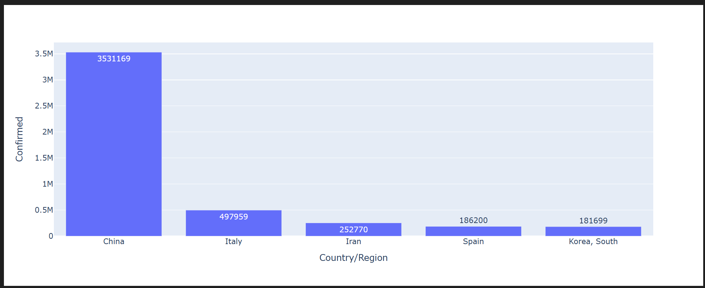

# COVID-19 Data Analysis 📊🦠

This repository contains an exploratory data analysis project on the global spread and impact of COVID-19 using time series datasets for **confirmed cases**, **deaths**, and **recoveries**.

##  Dataset

The analysis uses three CSV files located in the `COVIDATASET` directory:

- `time_series_19-covid-Confirmed_archived_0325 (1).csv`
- `time_series_19-covid-Deaths_archived_0325.csv`
- `time_series_19-covid-Recovered_archived_0325 (1).csv`

---

##  Tools & Libraries

Developed in **Jupyter Notebook** with:

- `pandas`
- `numpy`
- `matplotlib`
- `plotly.express`

---

##  Key Insights & Visualizations

### 🌍 Global Growth of Confirmed Cases


---

### 📈 Top 5 Affected Countries
Visualizing the countries with the highest number of confirmed cases:



---

## 🚀 How to Run

1. Clone the repository:

```bash
git clone https://github.com/Hikma-Ahmed7040/Covid-19-data-analysis
cd Covid-19-Data-analysis
